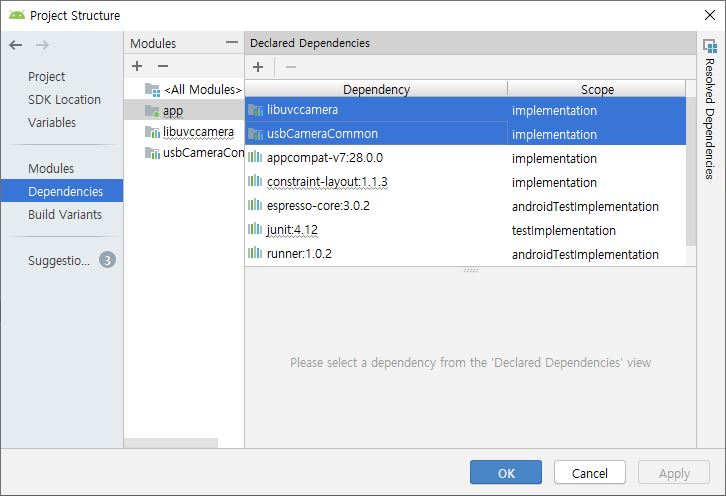

# UVC_CAMERA lib for ANDROID

This library built with the Android NDK r13b  is provided by saki4510t, where url is https://github.com/saki4510t/UVCCamera


## Usage

1. Unzip libuvccamera.zip, usbCameraCommon.zip 

2. Copy 2 directories in current Android studio project top directory

3. Add maven{ ... } path at build.gradle(Project) allprojects repositories

   ```
   allprojects{
   	repositories{
   		google()
   		maven { url 'http://raw.github.com/saki4510t/libcommon/master/repository/' }
           jcenter()
   	}
   }
   ```

4. Add ext{ ... } configuration at build.gradle(Project)

   ```
   ext {
       supportLibVersion = '25.3.1'
       commonLibVersion= '1.5.20'
       versionBuildTool = '25.0.2'
       versionCompiler = 25
       versionTarget = 23
       versionNameString = '1.0.0'
       javaSourceCompatibility = JavaVersion.VERSION_1_7
       javaTargetCompatibility = JavaVersion.VERSION_1_7
   }
   ```

   > Sync the versionTarget as targetSDKversion

5. Import lib in settings.gradle(Project Settings)

   ```
   include ':app', ':libuvccamera', ':usbCameraCommon'
   ```

6. Synchronize

7. Add Module Dependencies at 'app module' in Project Structure `Ctrl + Alt + Shift + S`


